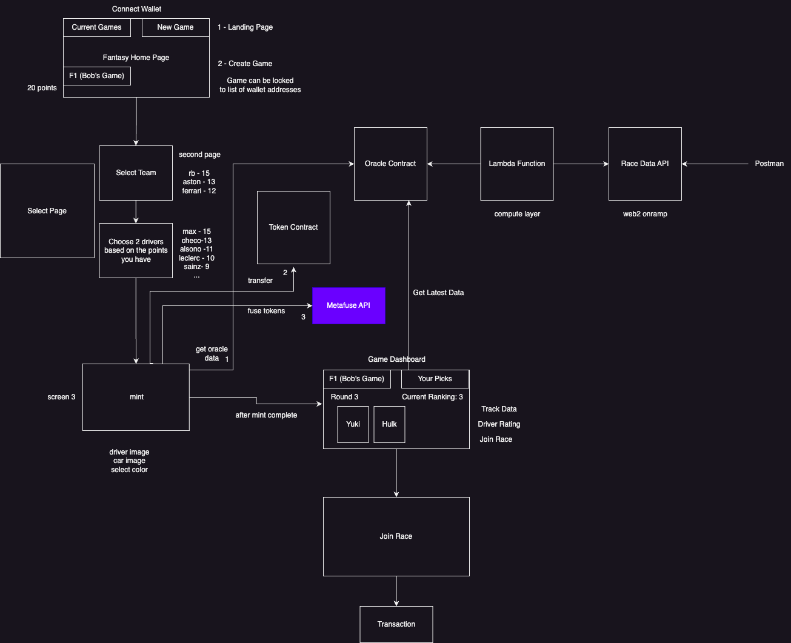

This is a [Next.js](https://nextjs.org/) project bootstrapped with [`create-next-app`](https://github.com/vercel/next.js/tree/canary/packages/create-next-app).

## Getting Started

First, run the development server:

```bash
npm run dev
# or
yarn dev
# or
pnpm dev
```

## Architecture Overview



## Our Hackathon Idea

# Project Title: Pitstop Protocol - A Fusion of Fantasy Sports and Web3

## Project Overview

Pitstop Protocol represents an ambitious attempt to connect traditional gaming with the emerging possibilities of Web3. At its core, it's a fantasy F1 game that leverages the power of blockchain, enabling players to modify and customize their drivers and teams dynamically. Our protocol revolves around the ingenious utilization of dynamic metadata and image regeneration concepts, coupled with the robustness of ERC721 standards. This approach facilitates truly verifiable, user-owned on-chain assets that can adapt and evolve as the user's in-game experience or level advances.

## Motivation

Our journey into the creation of Pitstop Protocol stemmed from a challenge - integrating the advantages offered by Web3 into traditional gaming. Observing the struggle experienced by many game developers in this domain, we felt the need for a solution that could seamlessly interweave these two spheres. For us, we wanted a way to showcase dynamic metadata and evolving digital assets.

## Addressed Problem and Our Solution

Pitstop Protocol offers a robust solution to the integration challenge. We've harnessed the power of ERC721 and dynamic metadata, creating a real-time, interactive gaming environment that evolves with the player. Our protocol's flexibility makes it applicable to a variety of fantasy sports, thus providing a broad-spectrum solution.

What sets Pitstop Protocol apart is its ability to use smart contract interfaces and financial incentives effectively. This functionality amplifies user engagement and immersion, pushing the boundaries of traditional gaming.

## Challenges Encountered

While our mission was clear, the path was strewn with technical challenges. A deep understanding of ERC721 standards and their implementation was required to ensure seamless interaction between on-chain assets and off-chain game mechanics.

One of the significant hurdles we faced was handling a multitude of variables inherent to sports data, ratings simulations, and cost points. While we could pull some data from real-world sources using oracles, a good deal had to be designed and adjusted to suit our game's universe. Creating an equitable scoring system and cost mechanisms was a mammoth task, requiring extensive theorycrafting and testing.

## Future Implications

This idea around Fantasy sports styled web3 gaming is poised to serve as a paradigm shift in the gaming industry, demonstrating the tangible benefits of Web3 integration. Our project paves the way for broader applications across various fantasy sports. We believe our efforts will inspire and guide future innovation in this intersection, leading to a richer, more immersive gaming experience.

As we continue to refine and expand Pitstop Protocol, we eagerly anticipate how it will reshape the landscape of fantasy gaming. In the face of rapid technological advances, we remain committed to pushing the boundaries of what's possible at the crossroads of gaming and blockchain technology.

# Deployed Chains

## XDC (Mainnet)

Oracle Deployed to -> 0xB34cFc9dBfc555290B8345978992B6A4f7B14aF3
Token Deployed to -> 0xc21A904117530E34D44cca524496EfDf41022B22
Canvas Deployed to -> 0x407794B377c13E7242c77053c18FfB196a481132
